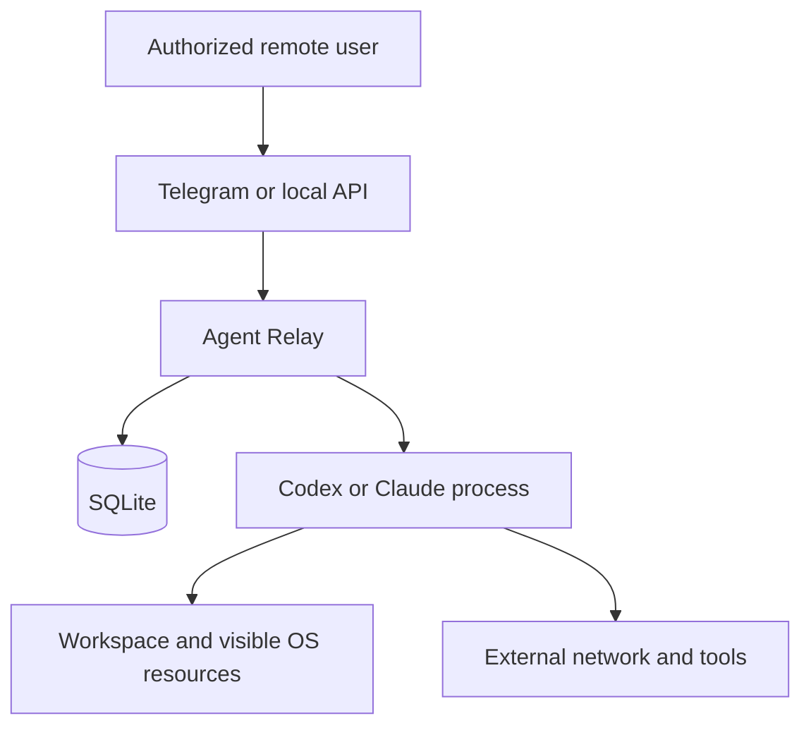

## 威胁模型与安全边界

## 保护目标

Agent Relay 需要保护以下高价值资产：

- 工作区源代码与未提交修改；
- Codex/Claude 登录态、Telegram Bot token 与 HTTP bearer token；
- prompt、plan、result、工具事件和 SQLite 会话历史；
- Agent 可能访问的 SSH agent 与外部服务。

安全设计默认远程 prompt、仓库内容、模型输出和 Telegram/HTTP 网络输入都可能包含恶意或误导性内容。

## 信任边界

下图展示远程入口、Relay 控制面、本地 CLI 与工作区之间的主要信任边界：

Relay 信任本机操作员正确配置白名单和文件权限，但不信任任意 Telegram 用户、无 token 的 HTTP 客户端、prompt、仓库指令或 Agent 建议。Codex/Claude CLI 是高权限依赖，会继承专用服务账号拥有的 OS 能力。

当前实现没有把控制面和 Agent worker 拆分到不同 UID。SQLite 的 `0600` 只能防止其他 OS 用户读取，不能防止同 UID 的 coding agent 访问。因此：

- 当前部署模型适用于内部完全互信的单信任域，不适用于相互敌对的多租户。
- 强租户隔离必须把每次 Agent 执行放到独立 UID 或容器中，并通过受限 IPC 返回事件。
- Relay 数据库、Bot/API token 和控制面 `.env` 不能挂载给隔离后的 worker。

## 已有控制

### 远程身份与入口

- Telegram 启用时强制配置 chat id 和 user id 两份 allowlist，请求必须同时命中。callback 也重新验证身份。
- 只有 run 的 initiator 能批准、拒绝或停止；其他已授权群成员不能替其决策。
- update id 按 Bot token 的不可逆短指纹持久去重，避免进程重启后重复执行，同时避免轮换 Bot 后的新 update id 与旧记录冲突。
- 单 user id 有每分钟更新限流；这是防误用措施，不是抗分布式 DoS 服务。
- HTTP 默认 loopback，业务端点始终要求常量时间比较的 bearer token。非 loopback 配置强制要求 token，但 TLS 必须由外部代理/隧道提供。
- bearer token 在服务端固定映射到 `API_ACTOR_ID`，客户端自报 header 不参与授权。当前 HTTP API 仍是单 token、单信任域，不是多租户认证系统。

### 执行授权

- `run` 始终先启动只读路由/plan phase。默认模式只有发起人批准后才启动 write/execute；工作区自动和完全访问模式会在计划生成后自动进入 execute。
- 审批有期限且原子决策；数据库状态转换防止重复批准和同一会话并发写任务。
- 审批粒度是整份计划的一次执行，不是逐命令、逐文件或逐工具确认。工具事件提供知情权和停止机会，但不是执行前拦截器。
- Telegram 审批计划最多 2400 字；超限、空输出、事件协议异常或缺少可恢复 session 时直接失败。执行 phase 只接收远程用户实际看到的同一份计划快照。
- `ask` 不要求审批，因为适配器以只读模式运行；如果 CLI 自身的 sandbox/permission 实现或内置网络能力没有遵守只读语义，Relay 仍无法回滚外部副作用。
- Codex 子进程通过临时配置覆盖禁用本机 `mcp_servers`，避免只读规划阶段调用具有外部副作用的个人 MCP；需要 MCP 的团队应先实现逐工具远程审批，不能直接删除该保护。
- 默认不启用 `--dangerously-skip-permissions`、无沙箱参数、root 或失败后的危险降级。只有发起人明确选择并二次确认“完全访问”的单次 run 才启用 Codex/Claude 对应危险参数；该选择持久化并出现在远程任务数据中。

### OS 与进程

- workspace 创建时及每个 phase 启动前都重新做真实路径解析，并限制在 `WORKSPACE_ROOTS` 下；解析结果必须与会话保存的 canonical path 一致，symlink 替换会失败关闭。
- prompt 通过 stdin 发送，argv 使用 `create_subprocess_exec`，不拼接 shell 命令。
- 子进程只继承 `AGENT_ENV_ALLOWLIST`，减少无关环境秘密暴露。
- `doctor` 在执行 CLI 的 version/auth 子命令前先检查符号链接路径与真实目标路径；相对路径和非 sticky 的全局可写目录会失败关闭。通过后 Adapter 固定执行 canonical absolute path，子进程 PATH 也会移除相对/不安全目录。CLI `serve` 与直接 ASGI lifespan 都强制运行同一门禁，不能换入口或切换远程 cwd 绕过。
- 每个 CLI 是独立 POSIX process group；取消升级为 SIGINT、SIGTERM、SIGKILL。
- stdout/stderr 字节数、可持久化事件行数、单个事件字段、prompt 和 handoff 都有上限，降低内存、磁盘与 Telegram 放大风险。
- Relay 新建的 SQLite 专用父目录和数据库文件分别收紧到 0700/0600；已有父目录保持原权限，日志与远程 payload 经过启发式秘密脱敏。

## 必须理解的残余风险

### Workspace allowlist 不是完整文件系统沙箱

allowlist 只控制远程用户可以选择哪个工作目录，不能拦截 Agent 或 `Bash` 使用绝对路径。不同执行方式的边界如下：

- Codex 的 `read-only` 和 `workspace-write` sandbox 提供 CLI 自身的隔离。
- Claude 的 `plan`、`dontAsk` 和 tool allowlist 主要属于 CLI 权限模型，不是 OS 文件沙箱。
- 允许 Claude 使用 `Bash` 时，同一 OS 用户可见的其他路径仍可能被访问。
- `full_access` 会显式取消 CLI 权限边界。
- `HOME` 默认被继承，以支持 CLI 登录和 session 恢复；同一账号下的其他文件因而可能暴露。

文件预览也不是任意文件浏览器。候选文件必须来自当前 run 的输出、事件或执行时间窗口，并在每次读取时重新解析真实路径。以下内容会失败关闭：

- 指向项目外的符号链接或包含路径穿越的请求；
- `.env*`、常见凭据文件和私钥格式；
- 超过 2 MiB 的文本文件或超过 25 MiB 的其他在线文件；
- 超过候选数量或目录扫描数量上限的结果。

这些控制仍不能保证项目源码本身不含秘密。生产环境应继续使用专用低权限账号和最小 workspace allowlist。

生产部署应优先使用专用 OS 账号，只授予目标 workspace；或使用可选 Docker 部署，只 bind mount 一个 workspace 和必要凭据。不要用普通个人账号的整个 home 作为 `WORKSPACE_ROOTS`。如果任务不需要 shell，从 `CLAUDE_ALLOWED_TOOLS` 移除 `Bash`。

### Prompt injection 和计划偏移

仓库中的 `AGENTS.md`、`CLAUDE.md`、代码注释或网页内容可能诱导 Agent 泄密或偏离请求。只读计划可以帮助发现明显风险，但计划文本本身仍来自不可信模型，不能证明执行一定逐字一致。

批准前应检查目标文件、命令类别，以及网络、部署、删除等副作用；执行期间应持续观察工具事件。高风险仓库应在一次性副本、独立分支或容器内操作。

跨 Agent handoff 是数据库中既有输出的有界摘要，明确标为低优先级历史背景，但它仍可能包含先前 prompt injection。接收 Agent 被要求重新验证，不能把它当成可信事实。

### 停止不是事务回滚

取消只负责尽力终止本次 CLI process group，不会撤销已经发生的操作：

- 信号到达前的文件写入、Git commit、数据库变更、云 API 或消息发送仍然有效。
- 子进程如果主动通过 `setsid` 脱离进程组，可能逃逸本次取消。
- 停止后必须检查 `git status`、目标服务和外部审计记录。
- Relay 不会自动执行 `git reset`、删除文件或补偿事务。

### 凭据与数据留存

- Telegram provider 会持有用户发送的 prompt 和 Bot 回复；不要通过 Telegram 传长期秘密。
- SQLite 明文保存 prompt、plan、result 和事件。脱敏使用有限正则，无法识别所有私有数据。
- CLI 凭据目录必须对 Agent 可读，且原生 session 通常要求可写；Docker mount 不等于凭据最小化。
- `SSH_AUTH_SOCK` 默认不传给 Agent；若为私有仓库显式加入白名单，就等于把 SSH agent 能力交给 coding agent，应在任务结束后撤销。
- API health endpoint 无鉴权，会暴露两种 CLI 是否存在及 Telegram 是否配置等低敏运行信息；保持 loopback 或由代理限制。

### 供应链与版本漂移

Codex 和 Claude Code 的 JSON 事件格式及 permission 行为可能随版本改变。Dockerfile 锁定构建参数，但原生部署使用操作员安装的版本。升级 CLI 后必须运行 parser tests、doctor 和真实只读 demo，再进行变更型验收。不要因为新版本不兼容而添加危险权限回退。

## 推荐部署基线

1. 每台机器一个专用 Bot token；每个 Bot token 只运行一个 long-polling 实例。
2. Telegram allowlist 精确到个人 user id；群聊不应只依赖 chat id。
3. HTTP 保持 loopback，通过 SSH/VPN 或认证 TLS proxy 调用；每个信任域使用独立随机 token。
4. 使用专用、无管理员权限的 OS 用户；只授予一个或少量具体 workspace。
5. `.env`、SQLite 和 CLI 凭据权限设为 0600，父目录 0700；不提交、不进入镜像。
6. 移除不需要的 `SSH_AUTH_SOCK`、`Bash` 和 API key 环境变量。
7. 高风险任务使用干净分支/副本，审批前检查计划，执行后检查 diff 和测试。
8. 保留结构化日志但设置最小可接受留存期；备份数据库时加密并限制读取者。

## 安全事件处置

怀疑 token 或 CLI 凭据泄露时，按以下顺序处置：

1. 停止 Relay 服务，不把 `cancelled` 当作无副作用证明。
2. 在 BotFather 撤销或轮换 Bot token，并轮换 API bearer。
3. 注销或轮换 Codex 与 Claude 凭据。
4. 检查 Telegram 更新、Relay JSON 日志、SQLite events、workspace diff、Git 历史和外部服务审计记录。
5. 清理完成后，使用新凭据运行 doctor 和只读 demo，再恢复 long polling。
