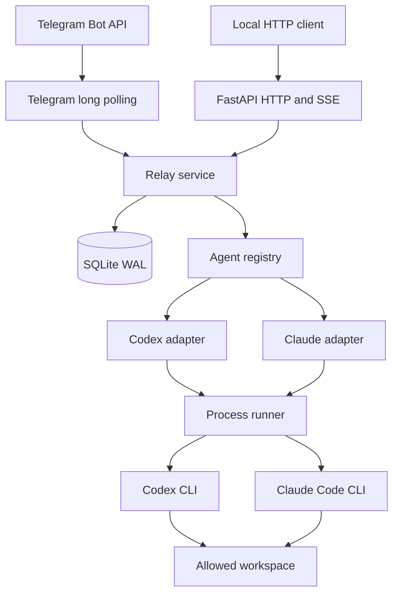
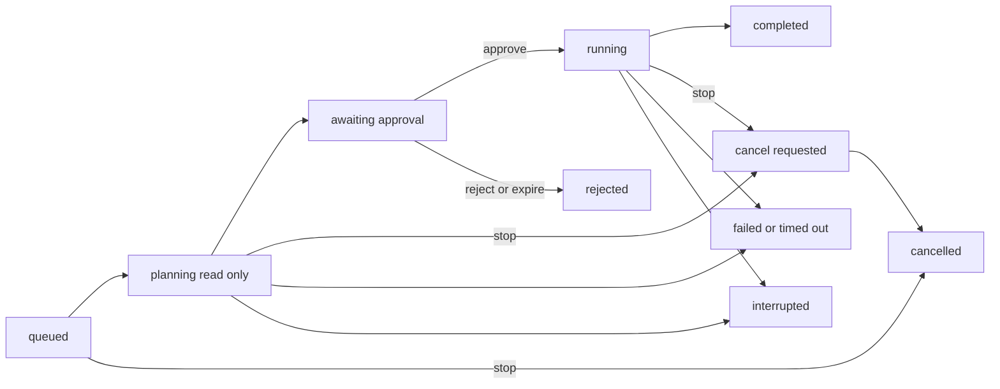

## 架构设计

## 目标

Agent Relay 将两个行为和事件协议不同的本地 coding agent 收敛为同一个远程控制模型。它负责远程身份边界、工作区选择、会话映射、两阶段执行、持久事件、取消与展示；它不重新实现 Codex 或 Claude Code 的推理、工具系统和登录协议。

同时支持两个 Agent 需要解决以下核心问题：

- 统一远程能力，但不伪造完全相同的流式语义；
- 分别保存两套原生 session，避免跨 CLI 误用 session id；
- 让跨 Agent 交接保持有界、可审计和低优先级；
- 让审批与取消状态独立于具体 CLI；
- 由适配器把变化较快的 CLI JSON 事件转换为稳定领域事件。

## 组件

下图展示两个远程入口如何共享 Relay 服务、持久层和 Agent 适配器：

Telegram 使用出站 long polling，不需要在开发机开放入站端口。HTTP 默认为 loopback；SSE 与 Telegram watcher 都读取同一份持久事件，因此远程界面和程序调用看到一致的任务终态。

## 请求路径

### 只读提问

`ask` 从 `queued` 进入 `planning`，但适配器实际收到的 phase 是 `ask`。Codex 使用 `--sandbox read-only`；Claude 使用 `--permission-mode plan`。成功后直接 `completed`，不创建审批记录。只读模式降低误操作风险，但不应被理解为对所有读取和网络访问的强制隔离，具体边界见[安全模型](安全模型.md)。

### 变更任务

变更任务采用只读规划和受控执行两个阶段，主要状态转换如下：

规划阶段产生可显示的 `plan`，内容应列明目标文件、命令类别、影响、验证和重大风险。审批是针对这份计划的一次执行授权。批准后重新启动同一 Agent 的执行 phase，并把已批准计划作为输入；服务不会在每次工具调用前暂停等待远程批准。

每个 run 持久化 `permission_mode`、`model` 和 `reasoning_effort`。适配器使用 run 快照构造 argv，避免排队期间的界面调整影响已提交任务。

三种权限模式的执行边界如下：

| 权限模式 | 审批行为 | Codex | Claude |
| --- | --- | --- | --- |
| `request_approval` | 计划获批后执行 | `--sandbox workspace-write` | `--permission-mode dontAsk` 与临时工具 settings |
| `workspace_auto` | 规划完成后自动执行 | 与 `request_approval` 相同 | 与 `request_approval` 相同 |
| `full_access` | Mini App 二次确认或受信 API 显式传参后自动执行 | `--sandbox danger-full-access` | `--permission-mode bypassPermissions --dangerously-skip-permissions` |

计划与实际操作之间仍可能因模型行为、仓库内容变化或 CLI 行为产生偏差。远程用户应观察工具事件，并在发现偏离时停止任务。

审批到期后审批记录变为 `expired`，任务变为 `rejected`。服务启动时残留的活跃任务统一标记为 `interrupted`，因为原生 CLI 进程是否仍存在以及文件写入位置都无法安全重放。

## 会话与 Agent 切换

`conversations.active_agent` 决定下一次任务使用哪个适配器。`agent_sessions` 以 `(conversation_id, agent)` 为主键，分别保存 Codex thread id 与 Claude session id。切换 Agent 仅改变 active agent，且当前会话有活跃任务时拒绝切换。

`active_conversations` 只是每个远程用户当前查看的会话指针，不参与 run 生命周期。因此：

- 切换会话、选择其他项目或离开项目只更新查看指针，不会取消任务或改变原 run 状态。
- Mini App 通过会话摘要轮询后台任务，并在侧栏展示运行状态。
- 用户切回原会话后，再读取完整 run 列表和最新输出。
- Agent 切换仍要求当前会话空闲，避免一次 run 在执行中改变适配器。

下一次非 execute phase 若检测到上一任务来自另一 Agent，会从最近任务构造最长 `HANDOFF_CONTEXT_CHARS` 的交接记录。交接记录明确标记为历史背景，要求新 Agent 重新根据工作区验证；它不是隐藏思维链，也不提升为系统指令。执行 phase 延续规划 Agent 自己的原生 session，不重复注入另一 Agent 的交接。

不同 transport 的所有权命名空间分开：Telegram owner 是 `chat_id:user_id`，API owner 是服务端固定的 `API_ACTOR_ID`。任务另外记录 `initiator_id`；批准、拒绝和停止必须同时匹配 transport owner 与相同 initiator。

## 远程可见性

领域事件是远程体验的稳定接口：

| 远程阶段 | 用户看到的内容 | 不会看到的内容 |
| --- | --- | --- |
| 排队/思考 | `queued`、`thinking`、`working`、phase、Agent 名称 | 隐藏思维链 |
| 工具工作 | 工具开始/完成、脱敏后的名称、输入或命令摘要、状态和有限结果 | 未经解析的无限 stdout、已识别凭据 |
| 公开回答 | Claude 文本 delta；Codex 完成的 Agent message；最终 plan/result | Codex 不存在的 token delta |
| 计费信息 | CLI 提供的 usage；Claude 可能提供 cost | Relay 推测的 token 或费用 |

事件文本、prompt 和本地诊断捕获都有长度上限。正则脱敏只是一道防泄漏措施，不保证识别所有秘密。

## 并发与取消

数据库部分唯一索引保证一个 conversation 最多一个活跃任务；全局 semaphore 限制同时运行的 CLI 数量。工作区没有祖先/后代重叠的不同会话可以并发，但都受 `MAX_CONCURRENT_RUNS` 限制。

每次 CLI 启动为独立 POSIX process group，不经过 shell，prompt 从 stdin 传入。取消流程按以下顺序升级信号：

1. 将领域状态更新为 `cancel_requested`。
2. 向进程组发送 `SIGINT` 并等待。
3. 未退出时发送 `SIGTERM` 并再次等待。
4. 仍未退出时发送 `SIGKILL`。
5. runner 返回后，任务才进入 `cancelled`。

取消不会撤销已经写入的文件、Git 记录、网络请求和其他外部副作用；主动脱离进程组的后台进程也不保证被捕获。

## 数据模型

SQLite 在初始化时启用 `foreign_keys=ON`、`journal_mode=WAL`、`synchronous=NORMAL` 和 busy timeout。数据库文件权限设置为 `0600`；由 Relay 新建的专用父目录设置为 `0700`，已有父目录的权限不会被擅自修改。

| 表 | 主键/唯一约束 | 用途与关键字段 |
| --- | --- | --- |
| `conversations` | `id` | transport owner、workspace、active agent、title、时间戳 |
| `agent_sessions` | `(conversation_id, agent)` | 每个会话每个 Agent 的原生 session id |
| `runs` | `id`；活跃状态下 `conversation_id` 部分唯一 | mode、status、prompt、model、reasoning effort、permission、plan、result、error、exit code |
| `events` | `id`；`(run_id, seq)` 唯一 | 有序事件类型、JSON payload、时间戳 |
| `approvals` | `id`；`run_id` 唯一 | pending/approved/rejected/expired、到期和决策身份 |
| `telegram_update_claims` | `bot_key + update_id` | 按 Bot 指纹做 long polling 去重，防止重启或轮换后误处理 |
| `active_conversations` | `(owner_type, owner_id)` | 每个远程所有者当前选中的会话 |

队列、租约和恢复规则如下：

- 同一会话允许存在多个 `queued` run，用于连续发送；部分唯一索引只覆盖处理中的状态，保证同一会话只有一个 run 正在处理。
- 调度器通过 SQLite `BEGIN IMMEDIATE` 原子领取最早的 queued run，领取成功后才建立 `workspace_leases`。
- 租约从规划开始持有到任务终态。完全相同以及祖先/后代工作区都视为冲突，避免根目录任务与子目录任务并发修改同一棵目录树。
- 未开始的 queued run 在服务重启后保留并重新调度；已经开始但未完成的 run 标记为 `interrupted`。
- 数据库初始化会原子重建处理中任务的租约；旧数据存在重叠处理任务时拒绝启动。
- 计划发布与 approval 创建、approval 决策与 run 状态转换分别在单个 SQLite 事务中完成。
- 事件序号在数据库事务中递增，SSE 客户端使用 `after` 恢复。这提供持久存储范围内的有序重读，不是跨地域消息总线。

文件预览通过独立的鉴权 API 提供。服务只从 Agent 最终结果、事件和 run 时间窗口内实际更新的文件中生成候选列表，并且只接受 canonical workspace 内的普通文件。

路径穿越、指向项目外的符号链接、环境变量文件和常见密钥格式都会被拒绝。文件 ID 只是相对路径的 URL-safe 编码，不是授权凭据；每次读取仍会重新校验 Telegram 身份、run 所有权、路径边界、文件类型和大小。前端通过携带 Telegram `initData` 的请求获取 Blob，再按图片、文本、PDF、音频、视频或普通文件卡渲染。

## 扩展新 Agent

新适配器需要实现 `kind`、`run(request, on_event)` 与 `cancel(run_id)`，并注册到 `AgentRegistry`。适配器必须直接构造 argv、从 stdin 传 prompt、使用经过白名单处理的环境、支持超时和进程组取消、把 CLI 输出限制后翻译为领域事件，并明确其只读/执行权限模型。若 CLI 无法提供可靠只读 phase，不应伪装为兼容实现。
